## Digital Identities 

A **digital identity** (also referred to as an **item**) is an instance of a **product** that has been digitized on the blockchain.  A digital identity can be a single NFT on the blockchain (in the case of durable products), or a fraction of an NFT paired with a unique PIN.  Associated with each digital identity is a QR Code, a numeric ID, an obfuscated ID and a PIN.  Digital identities have a custodian (a program or human that holds the private key and/or the PIN) and are sometimes associated with an owner (a specific company or human being).  The custodian and the owner can be the same person or thing, or they can be different.

## How a digital identity is created 
{:class="img-responsive"}

## Creating digital identities 

1. In the sidebar, click the **Inventory** option.

2. Under the Actions column of the product, click the "+" sign.

3. In box under "Number of new Digital Identities" type the number.

4. In the Notes box write a unique description of the purpose and characteristics of the "Batch" you are about to create.  These can include who the digital IDs are being created for, why they are being created, what they will be used for etc.

5. Click the "Create New Digital Identities" button and wait for the process to complete.  Please note that this action will be writing to the blockchain therefore will take a minimum of 10 seconds to complete.  If you create more than 40 digital identities, the minimum time for the action to complete will be (number specified)/40 * 10.

## After creating a digital identity

After you have created a digital identity you can now view it 2 ways in the TAM.
1. Go to Inventory page

2. Click on magnifying glass icon next to the Product.

3. Click on the "Batch" that you just created.

4. Click on the Details tab.

5. Click on the hyperlink of the number of the digital identity you wish to view.

**Or**, if you already know the digital identity's ID, you can
1. Click on Item Explorer

2. Enter the digitial identity's ID in the box.

3. Click the "Get NFT" button

## Pairing you digital identity with a physical item.

To pair a digital identity with a physical item we will need to physically associate a unique QR code/PIN combination to that item.  Using the TAM, you can print out the QR code/PIN combination and apply it to the item or the box containing the item.

1. Go to Inventory page

2. Under the Actions column, click on magnifying glass icon next to the Product you which to pair.

3. Click on the Download icon of the **batch** you want pair with physical items. 

4. Save the resulting csv file to your system.

5. Print the QR code/PIN combinations on your printer.

7. Apply each **smart label** to the physical item.


