##  Abstract 

A mutually agreed upon single source of truth in any _product life cycle_ would allow stakeholders to bypass costly trust-building processes and thus increase efficiency and reduce costs. A technology that uses cryptographic digital signatures to create irrefutable and universally accepted digital identities which are paired to real-world items would increase transparency and empower stakeholders to make quicker and more intelligent decisions. By establishing a consenus about the state of an item, friction is reduced and time-consuming, error-prone processes can be removed, optimized, or automated. The benefits of digital proofs extend far beyond merely improving existing processes. When a stakeholder has instant access to the real-time attributes of an item such as provenance, shipping history, location, custody, and ownership, new value-add services and industries can be created.

## Introduction

The Fourth Industrial Revolution, or Industry 4.0, was coined by World Economic Forum Founder Klaus Schwab as the “blurring boundary between the physical and digital world” [1]. Central to our technology is the pairing of a _digital identity_ to a physical item. An item begins its journey when a digital identity is created and assigned to that item. As an item makes its way through the manufacturing, logistics, sales, and consumer journey, each step is recorded as a _digital event_ on the blockchain. Since all stakeholders have instant access to these attestations, real-time analytics allow for confident, intelligent, and timely decisions to be made. The concept of a digital identity combined with an irrefutable history of digital events creates trust and transparency that can be leveraged to create new levels of consumer confidence and new opportunities for revenue generation.

{:class="img-responsive"}

##  Creating Opportunities 

While there are benefits of applying digital identities and digital events to the existing product life cycle, what if an organization could extend the product life cycle into new territory? We believe the life of a product does not end when the item enters the hands of a consumer. We see end-user engagement as an untapped opportunity in an item’s product life cycle. After an item is delivered to an end-user, the user immediately begins interacting with it. A platform that captures each interaction and allows analysis of the resulting dataset would create new opportunities. And one that encourages and enhances user engagement would create even more opportunities.

## An Example Use-Case

**A Verified Marketplace**

A company could use our tools to create a digital identity for each item sold in its e-commerce marketplace. Upon receiving an item in the mail, the user scans the smart label and verifies the authenticity of the item. After taking ownership of the item, the user is directed to content and services created by the brand. These services create many opportunities for user-engagement and user-analytics capture. A live example of this use-case can be found at [Real Items Marketplace](https://realitems.shop/collections/100-authentic-marketplace).

## Architecture - Simplified

Our architecture can be divided into roughly three layers:

* Client Layer
* Business Logic Layer
* Persistence Layer

The Peristence Layer can be further subdivided into 2 sub-layers:

* Mutable
* Immutable

{:class="img-responsive"}

## Components

We provide web and native applications along with API access options to facilitate tracking and tracing items throughout their product life cycle. By leveraging organizations’ existing ERP systems and IOT device infrastructure, our API integrations facilitate product life-cycle event recording automations on blockchain. We also provide a UI suite of tools enabling blockchain interaction when needed.

### TAM (Tokenized Asset Manager)

TAM is a web application that provides the ability to create digital identities for physical items. Once a digital identity is created, TAM is used to manage and monitor those digital IDs. It’s also used to manage the Users, Administrators, and Smart Contracts in a system.

### CP4 (Consumer Protection 4.0)

CP4 is a mobile application that is designed to allow the end-consumer to verify, take ownership, and manage the digital identities of the items they collect. CP4 is a mobile-first web app that requires no installation. After a user verifies and takes ownership of an item, they have access to all of the content and services associated with that item.

### Tracker

Tracker is a mobile application that records tracking events to the blockchain. Tracking information, such as timestamp and location is written to the blockchain and forever associated with an item’s digital identity. This info can also include text, photos, documents, videos and other content.

### RIS (Real Items Server)

The Real Items Server executes the business logic of our platform and handles interaction with the blockchain.

### GraphQL API

We make our GraphQL API available to developers so they can integrate our solution into their existing ERP systems.

### RIO (Real Items Oracle)

The Real Items Oracle is the gateway to the wider Real Items universe and is designed to facilitate visibility of items in other Real Items systems, making it possible for end-users to view other items in their closet.

## Barriers to Adoption

We have identified 4 major barriers faced by organizations that attempt to implement consensus-based product life cycle solutions.

1. ***All-or-Nothing Solutions*** - most solutions do not play well with existing ERP systems.  They often require a wholesale replacement of existing solutions and/or the purchase of expensive hardware or software.
2. ***Crypto-Maximilism*** - most solutions force users to have a deep understanding of cryptoeconomics and force customers to use a proprietary token, a cryptocurrency wallet or both.  This is not only counterproductive but also unnecessary.
3. ***Complicated Onboarding*** - most solutions require that the end-user download and install software and/or purchase cryptocurrency from an exchange.
4.  ***Volatile Transaction Costs*** - recording transactions on the blockchain is not free and the cost of these transactions can be volatile and expensive.  

## Our Approach

We have designed and built a system that sidesteps these barriers to adoption.  We have created a system that:

_Complements_ rather than replaces a company's existing systems and allows for incremental integration.  An organization can decide which parts of the system are most important to them and integrate them according to their needs and means.  We have designed our system to be flexible enough to run with commodity hardware and software. 

Requires _very little understanding_ of cryptoeconomics and does not force the user to use a proprietary token or a wallet.  We hide the cryptoeconomics as much as possible allowing users to focus on the task at hand.

_Does not require_ the end-user to install software or purchase cryptocurrency on an exchange. 

_Ensures low and stable transaction costs_.  This subject deserves its own section, which is below.

One of the biggest challenges for organizations is the _cost of transactions_.  The volatile price of blockchain transactions is a problem that plagues many smart contract platforms - most recently the highly popular Ethereum network.  As the Ethereum platform becomes more popular, the transaction volume increases.  As volume increases so does the valuation of its token, ETH.  Since ETH is used to pay for transactions (in the form of gas), the cost of a given transaction can change rapidly and without warning.  Volatile gas costs can make it difficult for an organization to extrapolate revenue streams. In addition, high prices can make the platform prohibitively expensive for many existing applications.  

Our solution to this problem is two-fold.  

First, we chose a core Blockchain technology that has already solved the transaction cost volatility problem. VeChain solves this by implementing a dual-token system - VET for currency and VTHO for gas. VET is used as the medium of exchange and store of value while VTHO is used to pay for transactions.  These two tokens are loosely-coupled and are controlled by its ***velocity***, the rate at which it is generated from VET.  Unlike Ethereum, the price of the cryptocurrency can rise and fall while transaction costs remain relatively stable.

Second, we have integrated the mechanism of ***fractionalizing*** into our core technology.  Built into our system is the ability to construct multiple digital identities from the same ***Non Fungible Record*** (NFR).  For non-durable goods, such as a can of soda or a bottle of ointment, we create a single NFR and then fractionalize it into multiple digital identities.  The number of digital identities derived from the NFR depends on the life span and use of a particular product.

### Whole NFRs

{:class="img-responsive"}

### Fractionalized NFRs

{:class="img-responsive"}

## Conclusion

We have built a system which provides a mutually agreed upon single source of truth for a product at any stage in its _product life cycle_.  On top of that we have built a set of tools that allow the various stakeholders to integrate with that system and derive the benefits of real-time knowledge of each stage of a product's life cycle.  Any existing organization that chooses to leverage this knowlege will be empowered with the ability to make intelligent short and long-term decisions regarding its economic relationship with that product.  This newfound ability creates new opportunities within an organization but also creates the opportunity for _new_ industries.

## References

[1] Klaus Schwab, "The Fourth Industrial Revolution: what it means, how to respond."  2016. [Online]. https://www.weforum.org/agenda/2016/01/the-fourth-industrial-revolution-what-it-means-and-how-to-respond/


